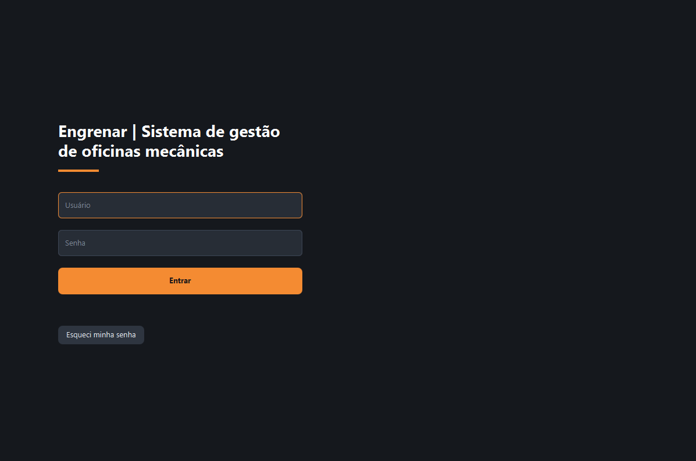
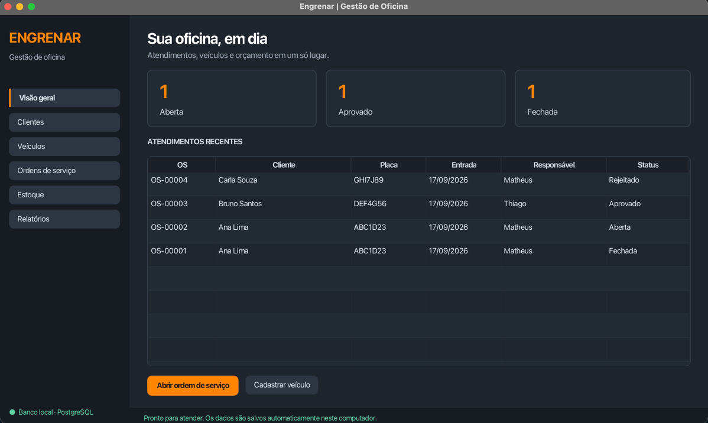
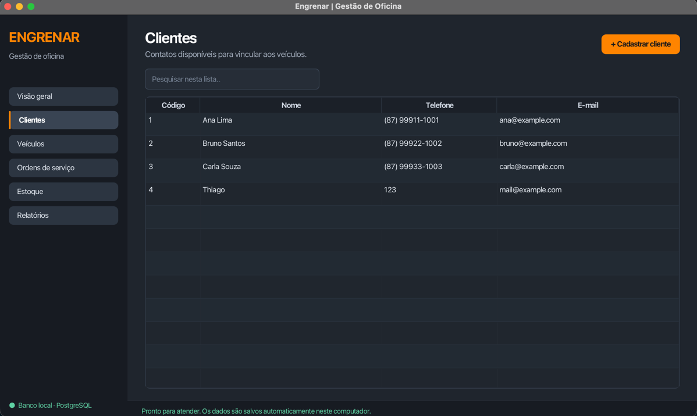
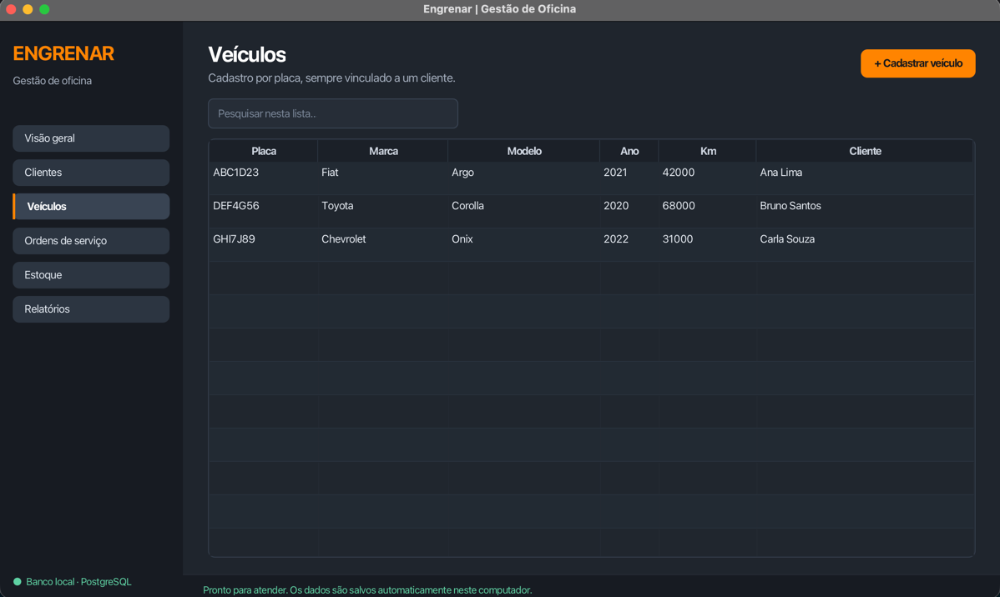
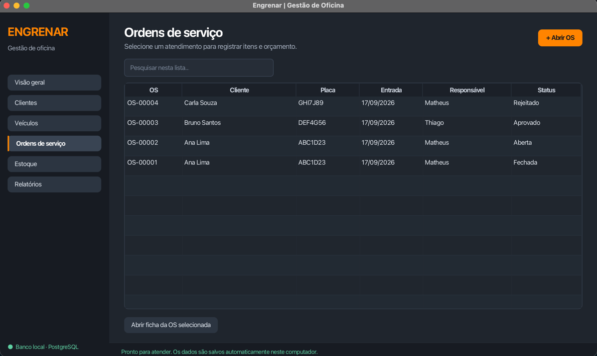
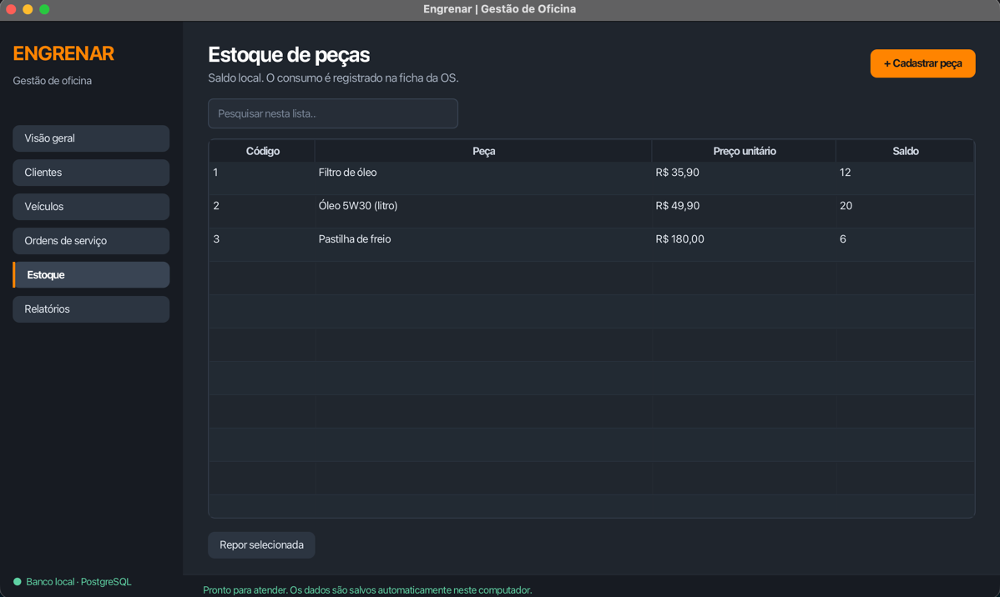
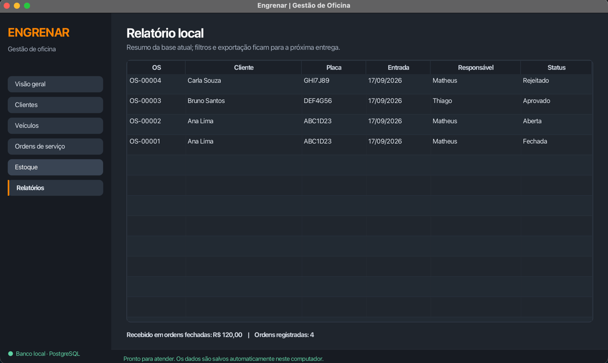

# Engrenar — Sistema de Gestão de Oficina Mecânica

Sistema desktop para gerenciamento de oficinas mecânicas, desenvolvido como parte da disciplina de **Engenharia de Software II — UNIVASF (2026.2)**.

O Engrenar centraliza o cadastro de clientes e veículos, gerenciamento de ordens de serviço, controle de estoque, elaboração de orçamentos e fechamento de serviços, utilizando uma aplicação JavaFX com persistência em PostgreSQL.

---

## Sumário

- [Objetivo](#objetivo)
- [Funcionalidades Principais](#funcionalidades-principais)
- [Tecnologias Utilizadas](#tecnologias-utilizadas)
- [Pré-requisitos](#pré-requisitos)
- [Banco de Dados](#banco-de-dados)
- [Como Executar](#como-executar)
- [Estrutura do Projeto](#estrutura-do-projeto)
- [Imagens do Sistema](#imagens-do-sistema)
- [Modelagem e Documentação](#modelagem-e-documentação)
- [Equipe](#equipe)
- [Contribuições](#contribuições)
- [Limitações e Melhorias Futuras](#limitações-e-melhorias-futuras)

---

## Objetivo

O Engrenar foi desenvolvido para auxiliar na gestão de oficinas mecânicas, centralizando as informações de clientes, veículos, ordens de serviço, peças e serviços realizados.

O sistema busca simplificar o fluxo operacional da oficina, desde o recebimento do veículo e registro da reclamação do cliente até a elaboração de orçamentos, execução dos serviços e fechamento da ordem de serviço.

A aplicação foi projetada para funcionamento **desktop e local**, utilizando um banco de dados relacional para garantir a persistência das informações.

### Público-alvo

- Oficinas mecânicas de pequeno e médio porte.
- Funcionários responsáveis pelo atendimento.
- Profissionais envolvidos na execução e gestão dos serviços.

---

## Funcionalidades Principais

### Cadastro de Clientes

- Cadastro de clientes com informações de nome, telefone e e-mail.
- Validação dos campos obrigatórios.
- Utilização do cliente cadastrado para vinculação com veículos e ordens de serviço.

### Cadastro de Veículos

- Cadastro de veículos vinculados a clientes existentes.
- Registro de placa, marca, modelo, quilometragem e ano.
- Validação de quilometragem não negativa.
- Verificação de unicidade da placa.
- Exibição do veículo correspondente quando uma placa duplicada é identificada.
- Atalho para cadastro de um novo cliente, com retorno à tela de veículos e seleção do cliente cadastrado.

### Abertura de Ordens de Serviço

- Seleção de cliente e veículo correspondentes.
- Registro da reclamação do cliente.
- Registro da data de entrada, quilometragem atual e responsável pelo atendimento.
- Geração automática do número da ordem de serviço.
- Atribuição do status inicial **Aberta**.
- Bloqueio da abertura de uma nova OS quando o veículo já possui uma OS ativa.
- Atalhos para cadastro de clientes e veículos.

### Diagnóstico e Serviços

- Registro de diagnóstico, inclusão, remoção e conclusão de serviços exclusivos do **Mecânico**.

- Registro do diagnóstico técnico.
- Adição de serviços recomendados e seus respectivos valores.
- Marcação de serviços como concluídos.
- Observações opcionais por serviço concluído, persistidas na OS e no histórico.
- Validação de diagnóstico obrigatório.

### Controle de Estoque

- Cadastro, reposição, consumo e remoção de peças exclusivos do **Gerente (administrador)**.

- Cadastro de peças.
- Registro de entrada e reposição de estoque.
- Controle de preço unitário e quantidade.
- Consumo de peças vinculado às ordens de serviço.
- Validação de saldo disponível.
- Bloqueio do consumo quando a quantidade solicitada excede o estoque.
- Remoção de itens com devolução da quantidade ao estoque.

### Orçamentos

- Inclusão de serviços e peças reais vinculados à OS.
- Cálculo automático dos subtotais.
- Cálculo do valor total do orçamento.
- Bloqueio da geração de orçamento sem itens.
- Registro de aprovação ou rejeição.
- Persistência da data, responsável e valor total da decisão.
- Congelamento dos itens e valores após uma decisão de orçamento.
- OS rejeitada pode ser reaberta para revisão ou cancelada, com motivo obrigatório e histórico. Revisão mantém peças e veículo vinculados; cancelamento devolve as peças uma única vez e libera o veículo.

### Fechamento de Ordens de Serviço

- Exibição do resumo dos serviços, peças e valor total.
- Exigência de aprovação prévia do orçamento.
- Verificação da conclusão dos serviços.
- Registro da forma de pagamento.
- Registro da data de retirada do veículo.
- Alteração do status da OS para **Fechada**.
- Liberação do veículo após o encerramento.

### Relatórios

- Acesso exclusivo ao perfil **Gerente**.
- Filtros combinados por data inicial/final de **entrada**, status e nome do cliente ou placa.
- Datas em `dd/mm/aaaa`, inclusive nas duas extremidades. Campo vazio significa sem limite.
- Quantidade de ordens, quantidade de fechadas e valor recebido nas OS fechadas do resultado filtrado.
- **Aplicar filtros** atualiza a consulta. **Limpar** retorna à base completa. Alterar filtros desabilita a exportação até aplicar novamente.
- **Exportar PDF** salva exatamente as linhas, filtros e totais exibidos, em A4 paisagem, com cabeçalho repetido, paginação e quebra de nomes longos.
- O valor de uma OS sem decisão aparece como **Não decidido**; ordens aprovadas/rejeitadas não entram no recebido. Este relatório usa a data de entrada da OS, não a data de recebimento financeiro.
- Consulta e exportação em segundo plano para manter a janela responsiva. Relatório vazio também pode ser exportado.

### Login e atualização do banco

- Contas de demonstração: `admin` (gerente), `ana` (atendente) e `carlos` (mecânico), todas com senha `123456`. São dados fictícios para uso acadêmico local.
- A migração 1 → 2 cria as contas de demonstração ausentes em bancos antigos, preservando clientes, veículos, OS e as contas/senhas existentes. Não é necessário excluir o volume do PostgreSQL.
- Consultas exigem sessão; comandos continuam verificando o perfil. Navegação e atalhos respeitam as permissões, e sair remove os atalhos anteriores.
- Gerente cadastra usuários e emite códigos de recuperação após confirmar sua senha. Cada código vale 15 minutos e só pode ser usado uma vez no botão **Esqueci minha senha**.
- Todos os perfis podem alterar a própria senha informando a atual. Novas senhas exigem 12 a 128 caracteres; PBKDF2-HMAC-SHA256 com 600.000 iterações e salt aleatório. Hashes SHA-256 antigos são atualizados após login válido.
- Recuperação é assistida por gerente; não envia e-mail. Consulte [validação dos novos fluxos](docs/validacao-evolucao.md).

### Testes

```sh
mvn clean test
# Inclui PostgreSQL 15 temporário, baixado pelo Maven, sem Docker:
mvn clean -Ppostgres-check test
# Testes PostgreSQL apenas:
mvn clean -Ppostgres-check -Dtest=PostgresIntegrationTest test
```

Os testes comuns usam H2 isolado e o toolkit JavaFX real (requer sessão gráfica). O perfil `postgres-check` inicia um servidor PostgreSQL local temporário em porta livre e o encerra ao terminar. Nenhum teste usa o banco da aplicação. O primeiro uso baixa os binários de teste. Imagens de verificação de tela/PDF ficam em `target/qa`.


## Tecnologias Utilizadas

| Tecnologia | Utilização |
|---|---|
| Java 17+ | Linguagem de programação |
| JavaFX | Desenvolvimento da interface gráfica desktop |
| Maven 3.9+ | Gerenciamento de dependências e execução |
| PostgreSQL | Banco de dados relacional |
| Docker | Containerização do banco de dados |
| Docker Compose | Gerenciamento dos serviços em containers |

---

## Pré-requisitos

Antes de executar o projeto, certifique-se de que as seguintes ferramentas estão instaladas:

- **JDK 17 ou superior**
- **Maven 3.9 ou superior**
- **Docker**
- **Docker Compose**
- Docker Compose com suporte a `up --wait` para usar `iniciar.cmd` (o script aguarda o healthcheck do banco).

Verifique as versões instaladas:

```
java -version
````

```
mvn -version
```

```
docker --version
```

```
docker compose version
```

## Banco de Dados

O sistema utiliza o PostgreSQL para armazenar os dados de clientes, veículos, ordens de serviço, serviços, peças e orçamentos.

O banco de dados é executado localmente por meio do Docker Compose.

### Inicialização do banco

Na raiz do projeto, execute:


```
docker compose up -d
```

Esse comando inicia os serviços definidos no arquivo `docker-compose.yml`.

### Configuração da conexão

As configurações de conexão com o banco de dados devem ser verificadas nos arquivos de configuração do projeto.

Confira especialmente:

* Host do banco de dados.

* Porta de conexão.

* Nome do banco.

* Usuário.

* Senha.

> Importante: As informações exatas de configuração dependem dos arquivos presentes no repositório. Consulte o `docker-compose.yml` e os arquivos de configuração da aplicação antes da execução.

### Verificar os containers

```
docker compose ps
```

Para visualizar os logs:

```
docker compose logs
```

## Como Executar

### 1. Clonar o repositório

```
git clone https://github.com/JBrunoSouza/Sistema-de-Gestao-de-Oficina-Mecanica/
```

Entre na pasta do projeto:

```
cd Sistema-de-Gestao-de-Oficina-Mecanica
```

### 2. Iniciar o banco de dados

```
docker compose up -d
```

Aguarde a inicialização do PostgreSQL.

### 3. Executar a aplicação

Utilize o Maven:

```
mvn clean javafx:run
```

Ou execute o script disponibilizado no projeto:

```
iniciar.cmd
```

### 4. Encerrar o ambiente

Para interromper os containers:


```
docker compose down
```

## Estrutura do Projeto

```
Sistema-de-Gestao-de-Oficina-Mecanica/
├── database/
│   ├── .keep
│   ├── schema.sql
│   └── seed.sql
│
├── docs/
│   ├── Diagrama_casos_de_uso.png
│   ├── Documento_de_requisitos_Engrenar.pdf
│   └── images/
│       ├── costumers.png
│       ├── dashboard.png
│       ├── os.png
│       ├── relatorios.png
│       ├── storage.png
│       └── vehicles.png
│
├── src/
│   └── main/
│       ├── java/
│       │   └── br/
│       │       └── edu/
│       │           └── univasf/
│       │               └── engrenar/
│       │                   ├── App.java
│       │                   ├── dao/
│       │                   │   ├── Database.java
│       │                   │   └── WorkshopDao.java
│       │                   ├── model/
│       │                   │   ├── Budget.java
│       │                   │   ├── Customer.java
│       │                   │   ├── OrderItem.java
│       │                   │   ├── OrderStatus.java
│       │                   │   ├── Part.java
│       │                   │   ├── ServiceOrder.java
│       │                   │   └── Vehicle.java
│       │                   ├── service/
│       │                   │   ├── ValidationException.java
│       │                   │   └── WorkshopService.java
│       │                   └── view/
│       │                       ├── EngrenarFxApp.java
│       │                       ├── Form.java
│       │                       ├── FxForm.java
│       │                       ├── MainFrame.java
│       │                       ├── MainWindow.java
│       │                       └── Theme.java
│       │
│       └── resources/
│           └── styles/
│               └── theme.css
│
├── docker-compose.yml
├── iniciar.cmd
├── pom.xml
└── README.md
```
### Overview da Estrutura

- `src/main/java`: contém o código principal da aplicação, organizado em:
    - `dao`: acesso e persistência de dados.
    - `model`: entidades e objetos do sistema.
    - `service`: regras de negócio e validações.
    - `view`: telas e componentes da interface gráfica.
- `src/main/resources`: contém arquivos de recursos, como o tema visual em CSS.
- `database`: possui os scripts de criação e inicialização do banco PostgreSQL.
- `docs`: reúne documentos, diagramas e imagens do sistema.
- `pom.xml`: configura as dependências e o processo de compilação com Maven.
- `docker-compose.yml`: configura o banco de dados PostgreSQL em um container Docker.
- `iniciar.cmd`: script para iniciar a aplicação no Windows sem precisar executar linhas de comando.

## Imagens do Sistema

### Tela de login



### Tela principal




### Cadastro de clientes



### Cadastro de veículos



### Abertura de ordem de serviço



### Controle de estoque



### Relatórios



## Modelagem e Documentação

A documentação do projeto está organizada na pasta `/docs`.

Os documentos relacionados ao desenvolvimento incluem:

* Documento de Requisitos.

* Diagrama de Casos de Uso.

* Diagramas de atividade e sequência para os casos de uso UC02, UC03 e UC06.

## Equipe

Projeto desenvolvido por alunos da Universidade Federal do Vale do São Francisco (UNIVASF), na disciplina de Engenharia de Software II — semestre 2026.2.

- [Thiago Roberto de Lima Ribeiro](https://github.com/devthiagoribeiro)
- [Matheus Souza da Silva Leite](https://github.com/theuzszz)
- [Luiz Antonio Lacerda Amorim](https://github.com/LuizAmorim19)
- [José Bruno de Souza Alves](https://github.com/JBrunoSouza)
- [Roger Rodrigues de Souza](https://github.com/RogerSoz)


## Contribuições

O desenvolvimento do projeto foi realizado de forma colaborativa, abrangendo análise de requisitos, implementação, modelagem, desenvolvimento da interface e integração com o banco de dados.

As principais responsabilidades envolveram:

| Tarefa | Colaboradores |
| -------- | -------- |
| Levantamento e especificação de requisitos   | Thiago, José Bruno, Matheus, Luiz Antônio   |
| Implementação das regras de negócio | Matheus |
| Desenvolvimento da aplicação desktop em JavaFX   | Luiz Antônio, Roger   |
| Persistência e integração com PostgreSQL   | Thiago |
| Desenvolvimento dos módulos de clientes, veículos e ordens de serviço   | Matheus |
| Implementação do controle de estoque e orçamentos   | Roger |
| Testes funcionais e validação dos fluxos do sistema   | Thiago, José Bruno, Matheus, Luiz Antônio, Roger |
| Documentação e revisão do projeto   | Thiago, José Bruno |


## Limitações e Melhorias Futuras

Apesar de implementar os principais fluxos operacionais de uma oficina mecânica, a versão atual apresenta limitações que podem ser trabalhadas em futuras versões.

### Interface e Experiência do Usuário

* Aprimorar o design das telas.

* Adicionar mensagens de feedback mais detalhadas.

* Melhorar a responsividade da interface.

* Expandir o suporte a atalhos de teclado.

* Aprimorar a acessibilidade e a usabilidade.

### Evolução do Sistema

* Implementar testes automatizados mais abrangentes.

* Melhorar a cobertura de validações e regras de negócio.

* Aprimorar o desempenho das consultas.

* Expandir a documentação técnica.

* Adicionar novas funcionalidades conforme as necessidades das oficinas.

## 📄 Licença

Este projeto foi desenvolvido para fins acadêmicos na disciplina de Engenharia de Software II — UNIVASF, semestre 2026.2.
